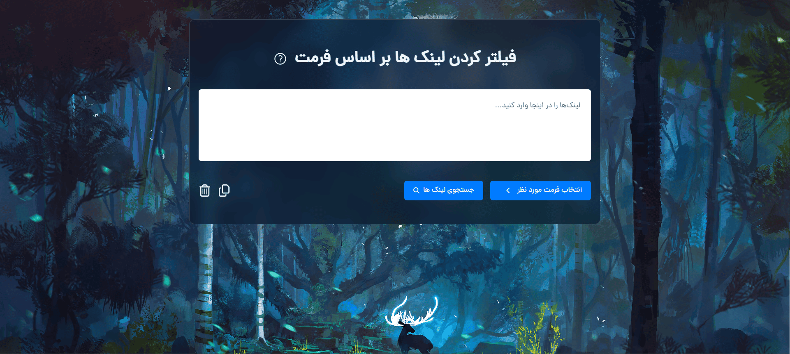

<div id="top"></div>


# درباره این پروژه کوچک
حقیقت اینه که یک روز میخواستم آموزش های یک دوره آموزشی رو دانلود کنم و از اونجایی که تعداد جلساتش زیاد بود روی دانلود همگانی زدم و یک فایل txt از تمام لینک های اون آموزش بهم داد و داستان از جایی شروع شد که فایل رو باز کردم و چیزی که دیدم این بود :
- 01-Introduction.mp4
- 01-Introduction-pr.srt
- 01-Introduction-en.srt
- 02-lets-start.mp4
- 03-lets-start.srt
- 04-lets-start.srt
- and ...

راستش تعداد جلساتش زیاد بود و میخواستم فقط ویدئوهاش رو دانلود کنم یعنی اونایی که فقط فرمت mp4 دارن ولی اگه میخواستم تک تک لینک فایل های زیرنویس رو حذف میکردم قطعا زمان زیادی میبرد و حوصله سر بر بود.

و اینجا بود که تصمیم گرفتم این مینی اپ کاملا رسپانسیو رو ایجاد کنم :)

## پیش نمایش پروژه


## نحوه کار باهاش چطوره؟

فقط کافیه اون لیست از لینک هایی که داریو به عنوان ورودی بهش بدی بعد فرمتی که مورد نظرت هست رو انتخاب کنی و روی جستجو کلیک کنید تا اون فقط لینک هایی که فرمت انتخابی شما رو دارن براتون پیدا و لیست بکنه ✅

---

## ساخته شده با :

- HTML
- CSS
- Tailwindcss
- JavaScript

---

## نحوه استارت کردن برنامه

1. ریپازیتوری رو کلون کنید
   ```sh
   git clone https://github.com/mersad-Bxtrue/Filterlink.git
   ```
2. برید به پوشه پروژه
    ```sh
    cd Filterlink
    ```
3. نصب پکیج های npm
   ```sh
   npm install
   ```
4. اجرا کردن اسکریپت
    ```sh
    npm run build
    ```
5. اجرای پروژه روی لایو سرور

---

